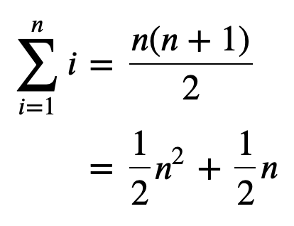

## Anagram Detection

For the sake of simplicity, we will assume that the two strings in question are of equal length and that they are made up of symbols from the set of 26 lowercase alphabetic characters. Our goal is to write a boolean function that will take two strings and return whether they are anagrams.

### Checking off

```py
def anagramSolution1(s1,s2):
    stillOK = True
    if len(s1) != len(s2):
        stillOK = False

    alist = list(s2)
    pos1 = 0

    while pos1 < len(s1) and stillOK:
        pos2 = 0
        found = False
        while pos2 < len(alist) and not found:
            if s1[pos1] == alist[pos2]:
                found = True
            else:
                pos2 = pos2 + 1

        if found:
            alist[pos2] = None
        else:
            stillOK = False

        pos1 = pos1 + 1

    return stillOK

print(anagramSolution1('abcd','dcba'))
```



### Sort and compare

```py
def anagramSolution2(s1,s2):
    alist1 = list(s1)
    alist2 = list(s2)

    alist1.sort()
    alist2.sort()

    pos = 0
    matches = True

    while pos < len(s1) and matches:
        if alist1[pos]==alist2[pos]:
            pos = pos + 1
        else:
            matches = False

    return matches

print(anagramSolution2('abcde','edcba'))
```


### Brutal force


### Count and Compare

```python
def anagramSolution4(s1,s2):
    c1 = [0]*26
    c2 = [0]*26

    for i in range(len(s1)):
        pos = ord(s1[i])-ord('a')
        c1[pos] = c1[pos] + 1

    for i in range(len(s2)):
        pos = ord(s2[i])-ord('a')
        c2[pos] = c2[pos] + 1

    j = 0
    stillOK = True
    while j<26 and stillOK:
        if c1[j]==c2[j]:
            j = j + 1
        else:
            stillOK = False

    return stillOK

print(anagramSolution4('apple','pleap'))
```

Again, the solution has a number of iterations. However, unlike the first solution, none of them are nested. The first two iterations used to count the characters are both based on n. The third iteration, comparing the two lists of counts, always takes 26 steps since there are 26 possible characters in the strings. Adding it all up gives us 𝑇(𝑛)=2𝑛+26 steps. That is 𝑂(𝑛). We have found a linear order of magnitude algorithm for solving this problem.

Before leaving this example, we need to say something about space requirements. Although the last solution was able to run in linear time, it could only do so by using additional storage to keep the two lists of character counts. In other words, this algorithm sacrificed space in order to gain time.

This is a common occurrence.

### Stack

```python
class Stack:
     def __init__(self):
         self.items = []

     def isEmpty(self):
         return self.items == []

     def push(self, item):
         self.items.append(item)

     def pop(self):
         return self.items.pop()

     def peek(self):
         return self.items[len(self.items)-1]

     def size(self):
         return len(self.items)
```
