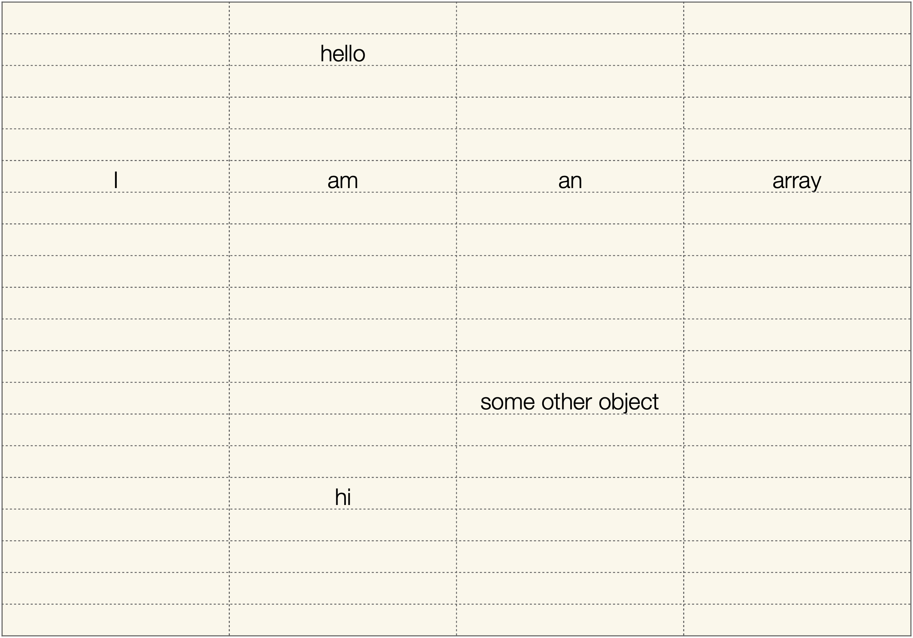
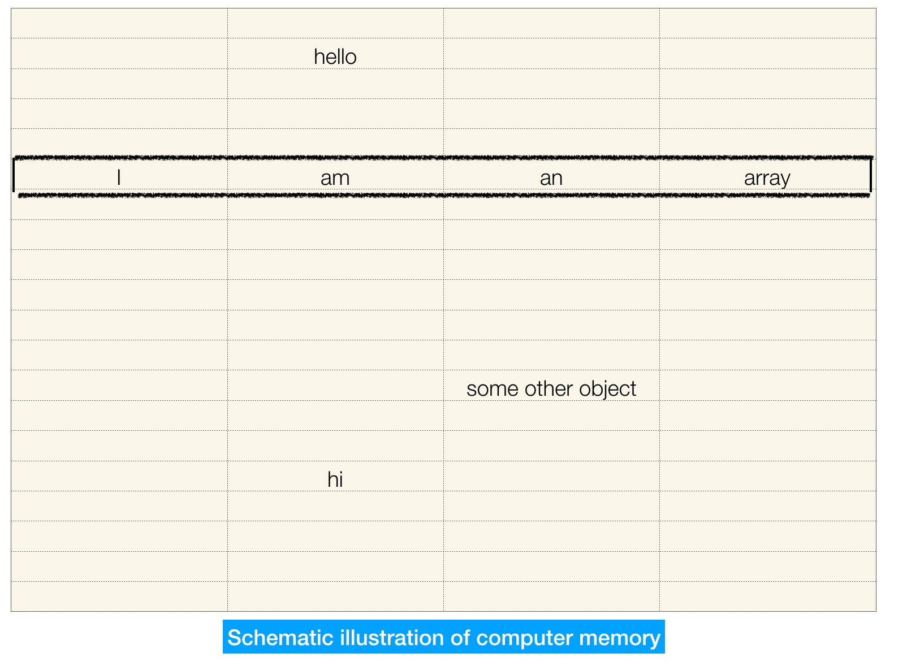
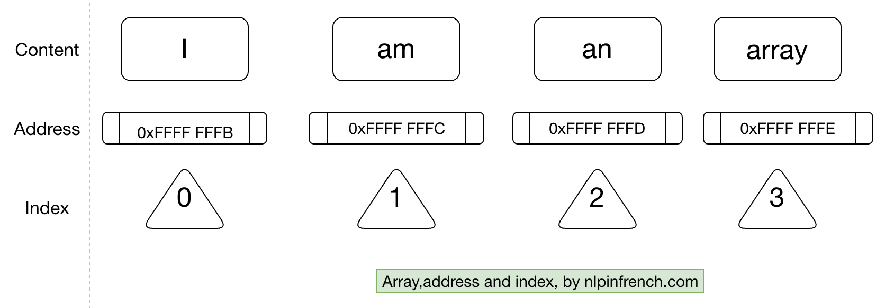
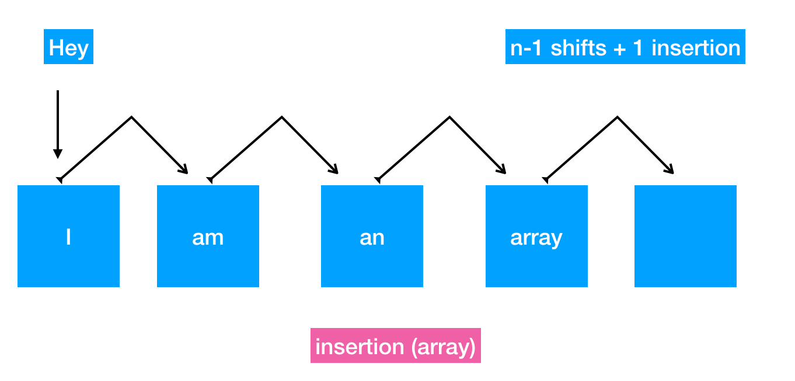
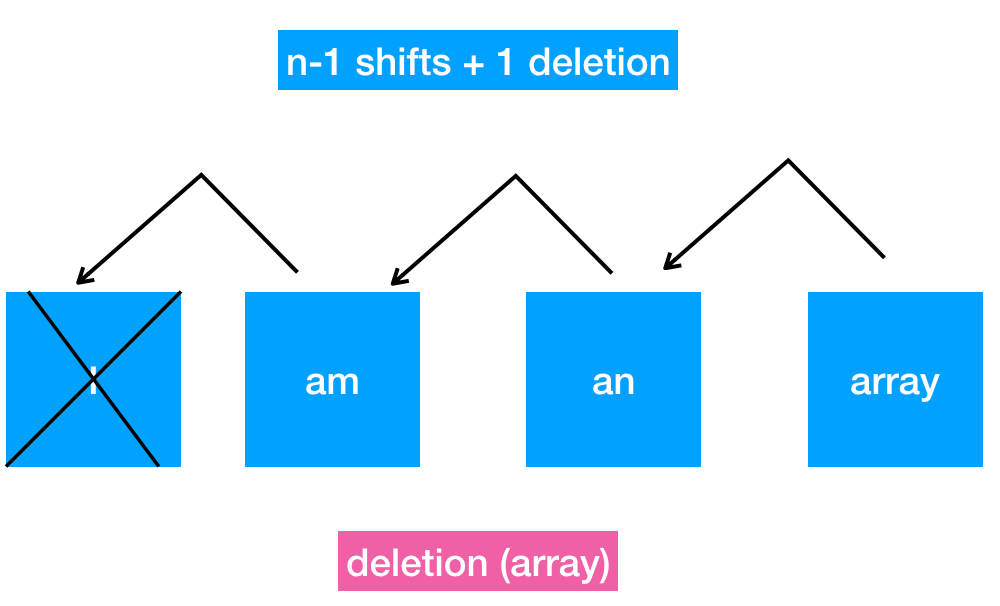

# backup

```python
def binary_search(arr, low, high, x):

    # Check base case
    if high >= low:

        mid = (high + low) // 2

        # If element is exactly present at the middle
        if arr[mid] == x:
            return mid

        # If element is smaller than mid, then check left subarray
        elif arr[mid] > x:
            return binary_search(arr, low, mid - 1, x)

        # Else, check right subarray
        else:
            return binary_search(arr, mid + 1, high, x)

    else:
        # Element is not present in the array
        return -1
```
