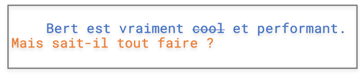

# 10 questions on Bert 🇬🇧

[Xiaooou Wang](https://scholar.google.fr/citations?user=vKAMMpwAAAAJ&hl=en)

## What is Bert?

The main component of Bert is a 12-layer neural network that processes text. The final layer of Bert can be adapted to your liking as long as it is relevant to your tasks (named entity recognition, sentimental analysis...).

## What are RoBERTa, XLNet, and ALBERT?

Models derived from Bert that have achieved better performance on benchmarks than Bert.

## Do I need to understand recurrence (CNN or RNN models) to understand the subtleties of Bert?

No, Bert is based on the transformer architecture. Moreover, only the encoder part is concerned.

## What is the difference between RNN and Transformer?

Recurrent neural networks only "look" at one word at a time and use hidden states to store, filter and integrate past information. This makes the model very complicated at various levels.

Beware, RNNs are a field of research in their own right. This deserves another series of tutorials.

## Link between Pre-training, Fine-Tuning and Transfer Learning?

Bert is pre-trained on a huge corpus with two tasks. Given the specificity of these two tasks, it is assumed (this is just an assumption) that the model will acquire a deeply contextualized understanding of the words (in concrete terms, these are embeddings). But this out-of-box model is not suitable for downstream tasks that require relearning on specific corpora (fine-tuning). The study of these two processes falls within the realm of transfer learning.

## What are the benefits of such an approach?

Training a model for a specific task often requires a huge corpus of a particular domain that is not necessarily available. Moreover it is very expensive in terms of time and computation. The fine-tuning process, in addition to saving time, achieves better performances than a home-made model trained from scratch.

But beware! This does not mean that fine-tuning takes a few seconds, it is just fast compared to Bert's pre-training and home-made models. Looking back in history, the benefits of this approach were first noticed in image recognition (branch of computer vision). Theoretically, there is little that is new.

## What tasks is Bert trained on?




As for Mikolov's word embedding, these are fake tasks or pre-training tasks. The first one (Masked Language Model) is to guess a hidden word in a sentence (like the word `cool`) and the second one (Next Sentence Prediction) is to determine if the second of a pair of sentences (like the sentence in orange) is the continuation of the first one.

## What are the advantages of Bert embeddings?

Since the word is hidden inside the sentence, Bert is supposed to acquire a contextualized representation using both the left and right context. This is also the case for BiLSTM but the context exploited by the latter is more restricted. Also it is to be noted that Bert has a fixed vocabulary made up of "wordpiece" (tokens, sub-tokens, characters), which makes it possible to treat out of vocabulary (OOV) problems in a more effective way.

## Why WordPiece?

Let's take `unconstitutionally`. If we train a vector for this word it is unlikely that we will find many occurrences of it. This word will then be under-represented. On the other hand, if we break it down into "un", "constitution", "al" and "ly". These three subtokens would be more frequent (thus more samples) in a large corpus and the combination of these 3 subtokens would constitute a better representation.

## How does fine-tuning work in practice?

This question is related to the question. The fine-tuning process depends on the last layer you add to Bert. Let's take sentimental analysis as an example. The figure we created illustrates this simple principle. After 12 Bert layers we add a binary classifier which, depending on the embedding of the CLS token (which includes the info of the whole sentence), predicts whether it is a positive or negative comment.


```{admonition} Next ?
:class: note

Tutorials on

* NER (named entity recognition)
* text classification
* fine-tuning on specific corpora

Stay tuned!
```
