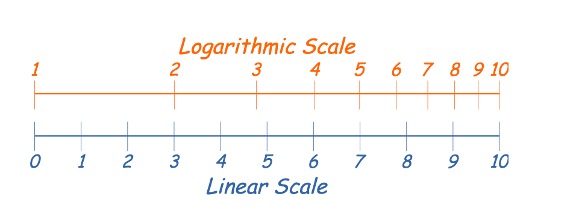
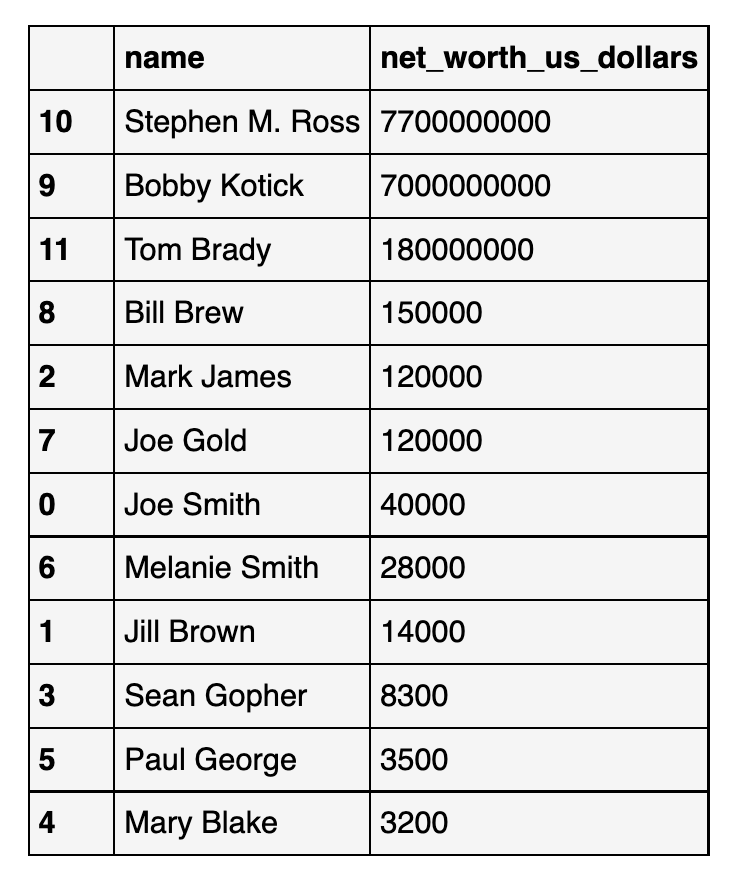
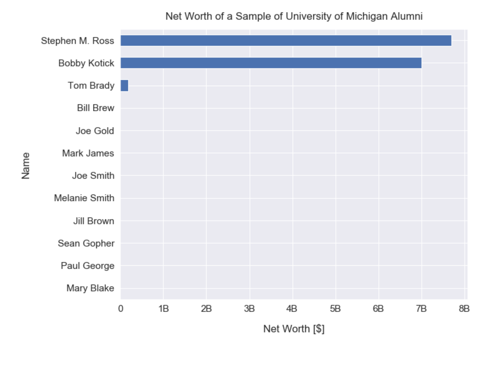
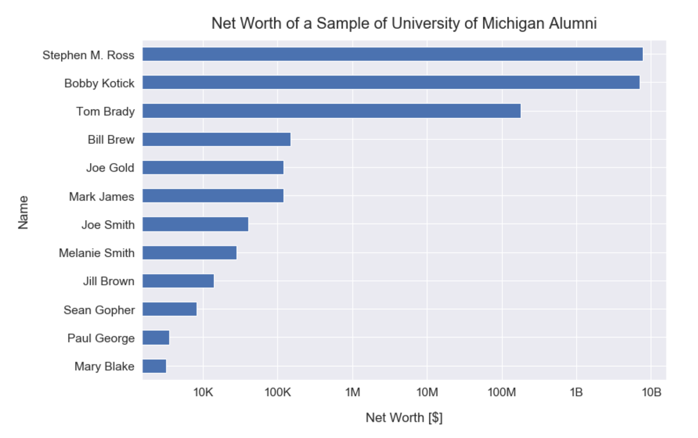
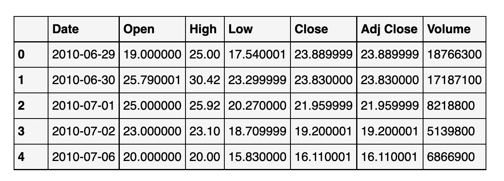
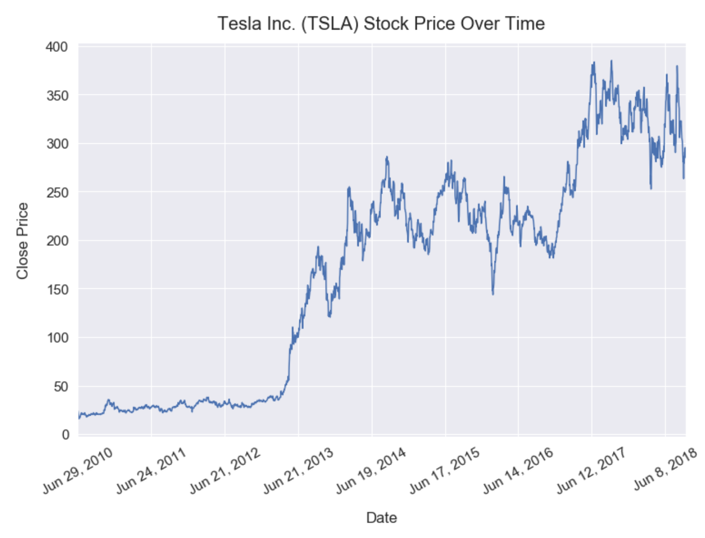
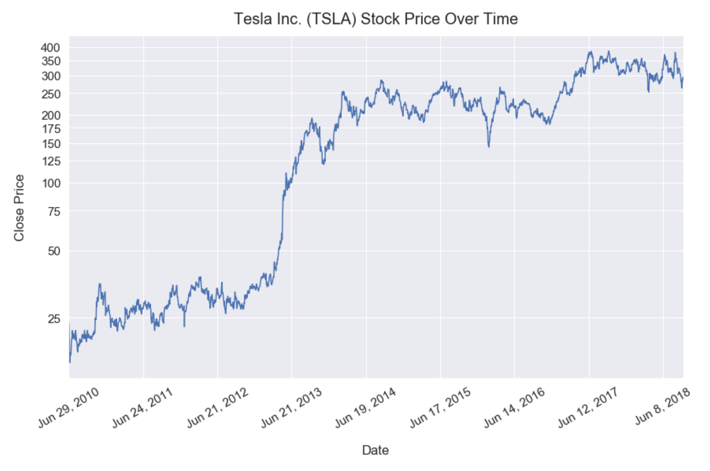

## What is the function of log scale

Logarithmic scale makes differences of small values more visible vs. diff of large values.

https://www.mathsisfun.com/definitions/logarithmic-scale.html

## why using log scale

https://www.indeed.com/career-advice/career-development/logarithmic-scale#:~:text=You%20typically%20use%20a%20logarithmic,scales%2C%20from%20farmers%20to%20researchers.

A logarithmic scale shows exponential growth on a graph. It's a nonlinear scale that's frequently used for analyzing a large range of quantities compactly. It is extremely useful when graphing a large variance in data.

You typically use a logarithmic scale for two reasons. The first reason is when large values skew the graph of the data, and the second is to show multiplicative factors or percent changes. Many careers use logarithmic scales, from farmers to researchers.

## Examples

### No Time series

https://dfrieds.com/data-visualizations/when-use-log-scale.html

Raw data:

Linear scale (small values are smeared):

Log scale:

### Time series

raw data:

linear scale (small values smeared, looks like there was no change during the first three years)

log scale (diff between small values receive more weights)

