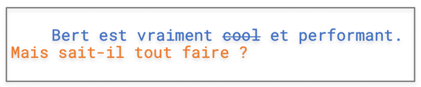

# A Title

## test 1

Should not be that hard. All we/you would need is to also accept ipynb in

sdfsdf

sdfsdf

sdfsdf

sdfsdf

sdfsdf

sdfsdf

sdfsdf

sdfsdf

sdfsdf

sdfsdf

sdfsdf

sdfsdf

sdfsdf

sdfsdf

sdfsdf

sdfsdf

sdfsdf

sdfsdf

sdfsdf

sdfsdf

sdfsdf

sdfsdf

sdfsdf

## test2

sdfsdf

sdfsdf

sdfsdf

sdfsdf

sdfsdf

sdfsdf

sdfsdf

sdfsdf

sdfsdf

sdfsdf

sdfsdf

sdfsdf

sdfsdf